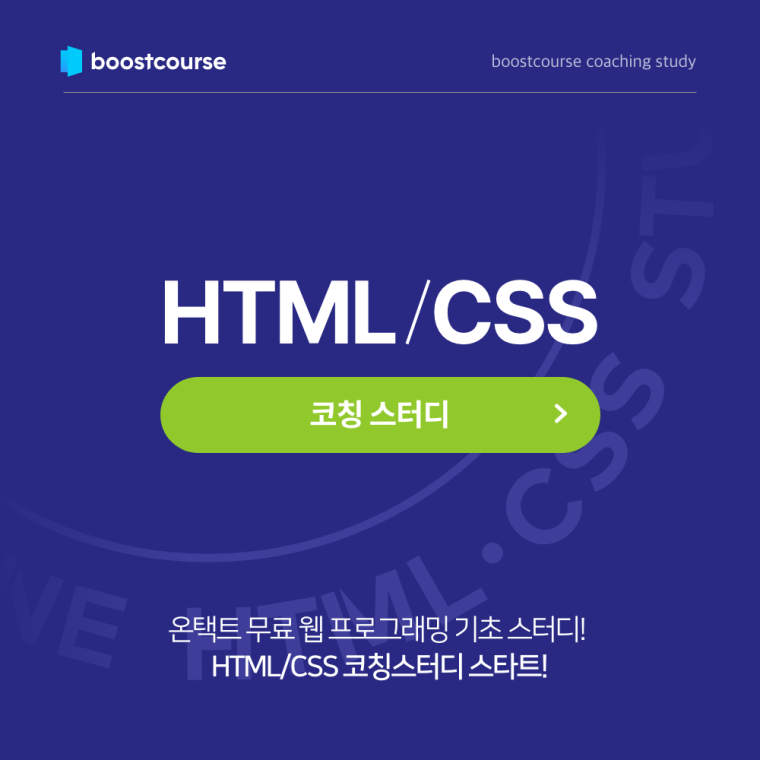

# 미션 1 
## Q1. 5주 차에 배운 개념을 정리해봅시다. 빈 칸을 채워 봐주세요. 
### 빈 칸에 들어갈 수 있는 키워드는 다음과 같습니다.

```HTML
max-, inline level, inline-block, display: none;, visibility: hidden:, float, static, 
absolute, relative, absolute, offset, z-index, , screen, width, min-, 미디어 쿼리, block level, position,fixed,

```

<br>

```html
1. _inline level_요소는 좌에서 우로 요소가 추가됩니다. 반면 _block level_요소는 위에서 아래로 추가됩니다. 이런 요소 배치 로직을 normal-flow라고 합니다.

참고: https://developer.mozilla.org/ko/docs/Web/CSS/CSS_Flow_Layout

 

2. _inline-block_ 속성값을 사용하면 해당 요소를 inline level 요소처럼 렌더링(배치)하지만 block level 성질을 가질 수 있게 할 수 있습니다.

 

3. _display: none;_을 설정하면 해당 요소가 화면에 렌더링 되지 않는 반면(DOM에 존재하지 않음)
_visibility: hidden;_ 을 설정하면 요소가 화면에 보이지는 않지만 렌더링 되며 화면에 공간을 가지고 있게 됩니다(DOM에 존재함).

 

4. 요소를 normal flow에서 벗어나서 띄우고 싶을 땐 _absolute_ 속성을 사용합니다. 
기사 글 서두에 이미지를 넣어주거나 첫 글자를 크게 키워서 보여주는 등의 목적으로 만들어진 이 속성은 
Flexible Box Layout과 Grid Layout이 나오기 전에 레이아웃을 짜기 위한 목적으로도 쓰였으나, 
Flexible Box Layout과 Grid Layout이 나온 이후에는 본래 목적 이외에 레이아웃을 짜기 위한 목적으로는 잘 쓰이지 않습니다.

```
참고그림1:


<br>

참고그림2:

참고:https://developer.mozilla.org/en-US/docs/Learn/CSS/CSS_layout/Floats#the_background_of_floats

```html
5. 요소를 원하는 위치로 이동시킬 땐 _position_ 속성을 사용합니다. 
일반적인 flow 알고리즘은 여러 요소가 한 픽셀을 차지하지 않도록 합니다. 
하지만 이 속성을 사용하면 요소(박스)를 겹치게 할 수 있습니다.


6. position 속성의 기본값은 _static_이고, _absolute_, _fixed_, _relative_값을 가질 수 있습니다. 
이 중 _absolute_는 해당 요소를 normal-flow에서 벗어나게 합니다.

 

7. __________은 요소가 화면에서 차지하는 영역 전체 크기를 나타내는데, 
요소의 너비와 높이에 패딩, 스크롤바, 테두리를 합친 크기이며 마진은 포함되지 않습니다. 
offsetLeft 값을 지정(CSS에서 left 속성)하면 offsetParent를 기준으로 요소를 오른쪽으로 옮길 수 있고, 
offsetTop 값을 지정(CSS에서 top 속성)하면 offsetParent를 기준으로 요소를 아래로 옮길 수 있습니다.

참고:https://ko.javascript.info/size-and-scroll에서 기하 프로피터 섹션

 

8.요소가 겹칠 때, 어느 요소가 더 위에 올라와야 하는지는 요소의 쌓임 규칙에 따라 결정됩니다. 
개발자는 __________를 사용해 쌓임 순서를 바꿀 수 있습니다.

 

9.__________를 사용하면 각 미디어 매체에 따라 다른 스타일(CSS style)을 적용할 수 있습니다.

 

10. __________은 미디어 타입에서 가장 많이 쓰이는 타입입니다. 미디어 특성 중 가장 많이 쓰이는 특성은 __________입니다.

 

11. 미디어 특성은 이름 앞에 __________ 또는 __________ 접두사를 붙일 수 있습니다. 
실제로 반응형 사이트를 제작할 때는 보통 접두사를 붙여서 사용합니다.
```


<br><br><br>


# 미션 2
## Q2.question.html엔 ```<div>```로 감싼 이미지가 하나 있습니다. 엇 그런데 뭔가 이상하네요.
### 이미지(``````)의 크기는 가로 300px, 세로 300px인데 이미지를 감싸는 div의 크기는 이미지의 크기보다 큽니다.
#### 개발자 도구를 열어서 ```<div>``` 요소와 `````` 요소의 computed 값을 캡처해주세요.
#### ```<div>```크기가 `````` 보다 큰 이유를 적어보세요.
#### ```<div>``` 세로 크기를 이미지 크기와 같게 하려면 어떻게 해야 하는지 적어보세요.


<br>

```html
<!DOCTYPE html>

<html lang="ko">

<head>
    <title>inline 요소 이해하기</title>
    <meta charset="utf-8">
    <meta content="width=device-width, initial-scale=1" name="viewport">
</head>

<body>
    <div>
        
    </div>
</body>
</html>
```


<br><br><br>


# 미션 3
## Q3. 툴팁은 아래 그림처럼 웹사이트에서 부연 정보를 선택적으로 보여주기 위한 수단으로 position: absolute; 가 쓰이는 가장 대표적인 예입니다.

그림1: <br>


### 툴팁을 만들고 있다고 가정해봅시다. 관련 요구사항은 다음과 같습니다. 
### 그런데 현재는 다음 그림과 같이 툴팁이 이상하게 출력되고, 툴팁 좌측이 설명을 덧붙이려는 텍스트의 첫 글자 좌측과 맞지 않습니다. 
### 스타일을 수정해 이를 개선해주세요.


<br><br>

그림 2: <br>


1. 툴팁 너비는 최소 150px이어야 합니다.
2. 툴팁 내 텍스트와 border 색은 검은색입니다.
3. 툴팁 내 텍스트 font weight는 400입니다.
4. 툴팁 내 텍스트 font size는 0.875rem입니다.
* 스타일을 제대로 수정했으면 이렇게 툴팁이 보여야 합니다.


```html
<!DOCTYPE html>

<html lang="ko">

<head>
    <title>위치 속성 fixed를 사용해 툴팁 만들어보기</title>
    <meta charset="utf-8">

    <style>
        .tooltip {
          /* 처음엔 툴팁이 숨어있습니다. */
          display: none;
          background: white;
          border: 1px solid;
        }
        
        /*
           마우스를 오버했을 때, 툴팁을 보여줍니다.
        */
        .tooltip-trigger:hover .tooltip {
          display: block;
        }

        p {
            max-width: 300px;
        }

        .tooltip-trigger {
            font-weight: bold;
            color: seagreen;
            text-decoration: none;
        }
      </style>
</head>

<body>
    <p>
        말풍선 또는 툴팁(tooltip)은 공통  
        <a href="/" class="tooltip-trigger">
            그래픽 유저 인터페이스
          <span class="tooltip">
            Graphic User Interface
          </span>
        </a>
        요소로, 마우스 포인터라 불리는 커서와 함께 동작한다. 사용자가 커서로 항목을 클릭하지 않고 가리키면 조그마한 상자가 항목 위에 나타나서 보충 설명을 보여준다.
      </p>
</body>
</html>
```


<br><br><br>


# 미션 4
## Q4.  Tailwind CSS는 빠르게 시장 점유율을 높여가는 CSS 프레임워크입니다. <br>Tailwind CSS 사이트를 방문해서 디스플레이 사이즈를 변경해가면서 <br>Tailwind CSS는 스크린 사이즈(width) 몇을 기준으로 미디어 쿼리를 분기 처리했는지 분석해보세요.
 
사이트 링크: https://tailwindcss.com/
