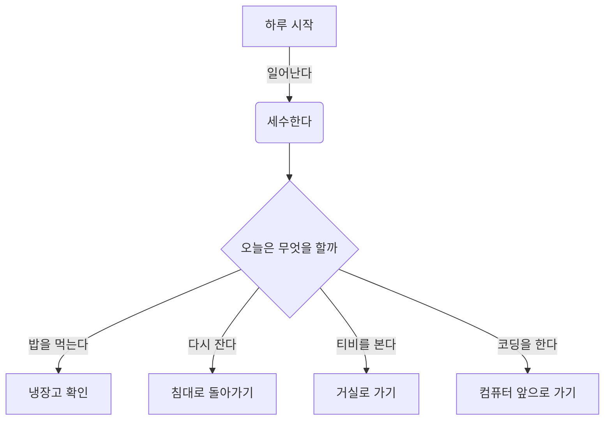

<p style="font-size: 1.5rem; " >📌 목차 </p>

- [Firebase](#firebase)
  - [Timestamp를 useFireStore.js에서 바로 import 하지 않고 config.js에서 먼저 import한 뒤에 export해서 받아오는 이유?](#timestamp를-usefirestorejs에서-바로-import-하지-않고-configjs에서-먼저-import한-뒤에-export해서-받아오는-이유)
  - [uid](#uid)
  - [clean up](#clean-up)
- [Git](#git)
  - [그외 명령어](#그외-명령어)
    - [stash](#stash)
    - [push 강제하기](#push-강제하기)
    - [revert](#revert)
    - [cherry-pick](#cherry-pick)
  - [브랜치 전략](#브랜치-전략)
    - [:one: Git flow](#one-git-flow)
      - [feature 브랜치](#feature-브랜치)
      - [release 브랜치](#release-브랜치)
    - [:two: Github flow](#two-github-flow)
    - [:three: feature branch](#three-feature-branch)
    - [:four: etc](#four-etc)
  - [프로젝트 관리하기](#프로젝트-관리하기)
  - [순서도](#순서도)
  - [Github Action](#github-action)

# Firebase

## Timestamp를 useFireStore.js에서 바로 import 하지 않고 config.js에서 먼저 import한 뒤에 export해서 받아오는 이유?

- 굵직한 것들을 config에 모아놓고 관리하기 위한것임. 큰의미는 없음.
- 강사님은 초기화하는 것들을 모아서 관리하는 편
- 취향에 따라서 결정할 것

## uid

- 사용자를 구분해주는 키값

## clean up

- useEffect가 달린 함수가 언마운트 될때 자동 실행되는 함수

<br><hr><br>

# Git

<br>

## 그외 명령어

### stash

- 잠깐 작업한 사항을 보관하기 위해서 사용
- 내 코드가 사라짐. 따라서 불안해짐. 그래서 실제로는 push를 하는 경우가 많음.
- stash하기보다 commit 하고나서 cherrypick 이용하는 것을 권장

### push 강제하기

- 회사에 불려가서 엄청난 문책을 당할 수 있는 명령어이므로 유의해서 사용할 것

```bash
git push -f origin main
```

### revert

- 여러 명이 원격 저장소를 다루는 협업에서 reset 사용은 지양하는 것이 좋다.
- 따라서 에러를 방지하며 push된 commit 이력을 되돌리고 싶은 경우 revert를 사용함. revert는 특정 커밋 이력을 되돌리는 작업도 하나의 커밋으로 간주하여 기존의 히스토리는 남긴채로 새로운 커밋 히스토리를 추가함

### cherry-pick

<br>

## 브랜치 전략

### :one: Git flow

- 감귤마켓 프로젝트에는 적합하지 않음.
- 대규모 프로젝트에 적합
- 트리가 복잡함

#### feature 브랜치

- feature 브랜치에서 기능구현을 하고 develop 브랜치에 붙임
  - 이 경우 보통 default branch를 develop 브랜치로 바꾸고 나서 작업하는게 좋음
- 일반적으로 `feature/기능` 꼴로 명명함

#### release 브랜치

- 실제 배포 전 테스트 및 버그확인용 브랜치
- ㅁ

### :two: Github flow

### :three: feature branch

- git-flow에서 main, develop, feature만 가져와서 사용함
- develop에서 완성되면 main에 붙임

### :four: etc

- 기존의 전략외에 직접 우리가 전략을 수립해서 깃헙 브랜치 전략으로 삼을 수 있다

<br>

## 프로젝트 관리하기

- Notion
- Github project
- Jira

## 순서도

- Figjam

- 머메이드 예시



<br>

- 구글 드라이브 > 더보기 > 다이어그램 > 시퀀스 다이어그램

## Github Action

- 주기적으로 내 레포지토리에 index.html이 쏴줘야 할때 사용
- 주기적으로 내 컴포넌트가 바뀔 때 사용

- 빌드를 하지 않고 push하면 사람들이 확인할 수 없음
- github action을 사용하면 내부적으로 빌드가 되게 만들 수 있음.

  - 내가 `.jsx`파일만 올리면 내부적으로 알아서 빌드해서 사용자에게 보여지는 화면으로 돌려줌
